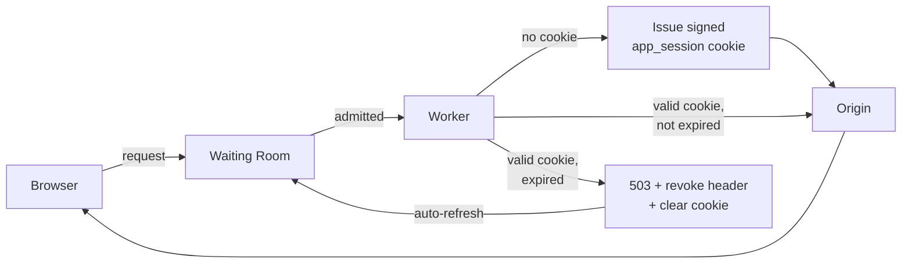
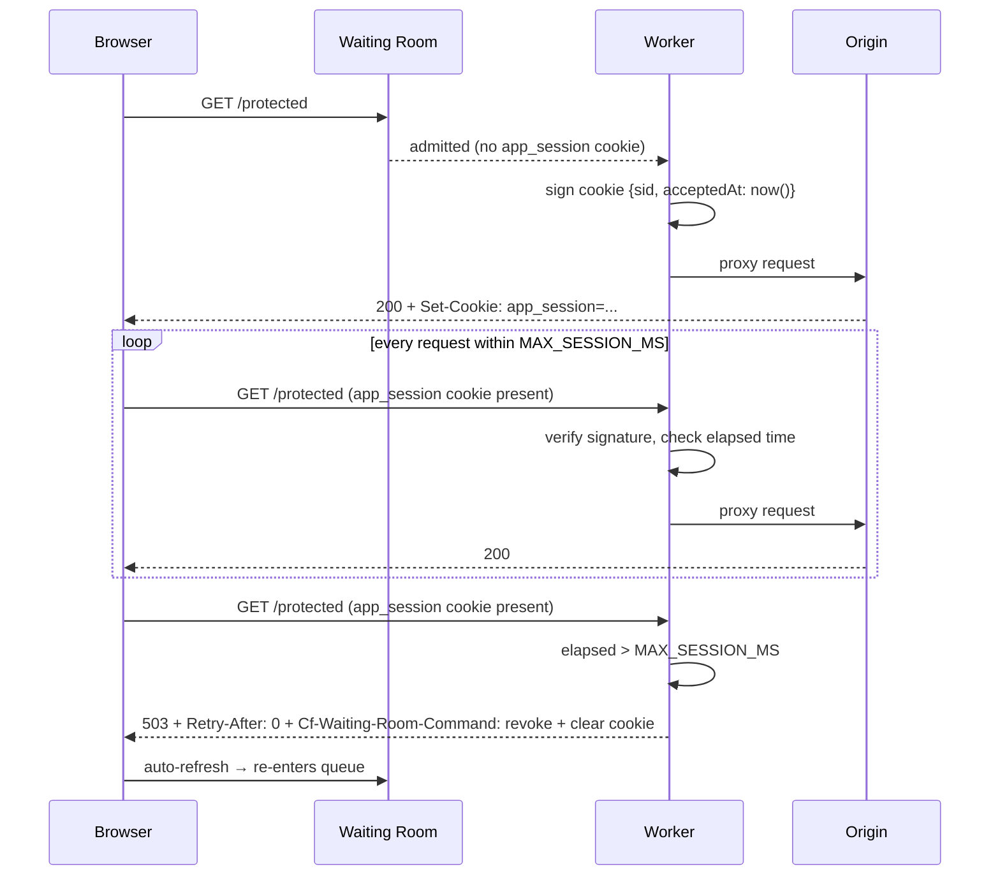

# Cloudflare Waiting Room - Max Session Check

> **Disclaimer:** This code is provided as a sample/template for educational and reference purposes only. It is provided "as-is" without warranty of any kind. See the [LICENSE](LICENSE) file for details. You are responsible for reviewing, testing, and adapting this code for your own use case before deploying to production.


A Cloudflare Worker that enforces a hard wall-clock session limit on top of a Waiting Room. It prevents users from staying in the application indefinitely, regardless of whether the Waiting Room is configured to auto-renew sessions.

## How it works

The Worker sits between the Waiting Room and the origin. It issues a signed `app_session` cookie to every newly admitted user, recording the exact time they were first let in. On every subsequent request it checks the elapsed time. Once the limit is exceeded, it clears the cookie and sends `Cf-Waiting-Room-Command: revoke` — the Waiting Room then expels the user back to the queue. The browser auto-reloads and the user rejoins the queue immediately.

### Request flow



### Session lifecycle



## Setup

**1. Install dependencies**

```bash
npm install
```

**2. Set the HMAC secret**

Generate a secure key:

```bash
openssl rand -base64 32
```

Set it as a Worker secret:

```bash
npx wrangler secret put HMAC_SECRET
```

Paste the generated key when prompted.

**3. Configure the route**

Edit `wrangler.jsonc` and update `routes` to match the hostname and path of your Waiting Room.

**4. Deploy**

```bash
npx wrangler deploy
```

## Configuration

| Variable | Type | Default | Description |
|---|---|---|---|
| `HMAC_SECRET` | Secret | — | Required. Signs and verifies session cookies. |
| `MAX_SESSION_MS` | Var | `3600000` | Hard session lifetime in milliseconds (default: 1 hour). |
| `SESSION_COOKIE` | Var | `app_session` | Cookie name used by the Worker. |

The Waiting Room's `session_duration` and `disable_session_renewal` settings are independent. This Worker enforces the ceiling regardless of how the Waiting Room is configured.

## Testing

**1. Lower the session limit temporarily**

In `wrangler.jsonc`, set:

```jsonc
"MAX_SESSION_MS": "120000"  // 2 minutes
```

Redeploy: `npx wrangler deploy`

**2. Enter the application**

Open the protected URL in an incognito window and pass through the Waiting Room. Confirm normal `200` responses and that `app_session` is set in the browser's cookies.

**3. Inspect the expiry**

After ~2 minutes, reload the page. You should see:
- A `503` response with `Cf-Waiting-Room-Command: revoke` and `Retry-After: 0` in the headers
- The `app_session` cookie cleared
- The browser auto-reloads and lands back in the Waiting Room queue

To inspect headers directly:

```bash
curl -v -b "app_session=<paste cookie value>" https://<your-route>
```

**4. Restore for production**

```jsonc
"MAX_SESSION_MS": "3600000"  // 1 hour
```

Redeploy: `npx wrangler deploy`
